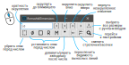

Romashki Dimensions
===================

**Romashki Dimensions** &mdash; это программа для&nbsp;упрощения и ускорения работы с&nbsp;размерами в&nbsp;чертежах в&nbsp;Компас-3D. Также работает и в эскизах 3D-моделей.

Интерфейс и функционал
----------------------

Окно программы по-умолчанию выводится в режиме "поверх всех окон", но это можно изменить в настройках.

При работе программы подразумевается, что пользователь откроет двухмерный графический документ (чертеж, фрагмент или эскиз в 3D-модели) и выберет объекты. Если среди выбранных объектов будут размеры, то с ними можно произвести следующие действия:

* Округление размеров к ближайшему, вниз или вверх согласно заданной кратности. Например, можно округлять не только до целых (кратность&nbsp;1: 33,14&nbsp;→&nbsp;33), но и кратно 5 (33,14&nbsp;→&nbsp;35) или кратно 0,1 (33,14&nbsp;→&nbsp;33,1).

    Кратность округления задаётся в поле ввода вращением колёсика мыши из зацикленного ряда: ... 10/12, 1, 10/6, 2, 2,5, 100/24, 5, 100/12, 10 ... ; также кратность можно вписать вручную. Числа, отнесенные к 6, 12, 24, предназначены для округления углов при записи с минутами и секундами.

    Работа функции представляет собой получение значения размера с максимально возможной точностью, округление с заданной кратностью, текстовое оформление числа (удаление незначащих нулей в конце), снятие флага "Автоопределение значения размера" и запись текста в размерную надпись.

    Можно вернуть неокругленное значение (т.&nbsp;е. поставить флажок "Автоопределение значения").

    Поддерживается округление угловых размеров в двух вариантах: с записью градусов, минут, секунд; и с записью градусов в десятичной системе. Выбор варианта осуществляется в настройках.

* Установка и снятие знаков диаметра, квадрата, радиуса, метрической резьбы перед размерным числом.

* Установка и снятие звёздочки `*` после размерного числа. Если у выбранных размеров уже установлена звёздочка, вызов этой команды убирает её.

* Смена видимости выносных линий в циклическом режиме: вызов команды убирает видимость сначала одной линии, потом - другой, потом - обеих, и на четвёртое нажатие обе линии снова видимы.

* Переключение стрелочек на засечки и наоборот в циклическом режиме: сначала одна - засечка, потом - другая, потом - обе засечки, потом - обе снова стрелки.

При создании чертежей в параметрическом режиме и при внесении изменений может возникнуть необходимость обновить округленные размеры. Для этих целей предназачена команда "**Выделить размеры с ручным вводом**", которая выделяет размеры во всех видах чертежа (или среди заранее выделенных размеров), у которых снят флажок "Автоопределение значение размера".

Скачать
-------
Программа поставляется в виде одного исполняемого файла. Устанавливать ничего не требуется.

Последнюю версию можно скачать в разделе [Релизы](https://github.com/nikitamamay/romashki-dimensions/releases).

Работа с исходным кодом
-----------------------

Для работы с исходниками нужно подготовить файлы библиотек Компас&nbsp;API согласно [видео-инструкции](https://youtu.be/UVCH_wDlFNU?t=863) от Сергея Кузьмина, а именно:

1. Установить пакет `pywin32`:

        pip install pywin32

2. Скопировать файлы:

        Kompas6API5.py
        KompasAPI7.py
        ksConstants.py
        ksConstants3D.py
        LDefin2D.py
        LDefin3D.py
        MiscellaneousHelpers.py

    из папки (путь может отличаться):

        C:\ProgramData\ASCON\KOMPAS-3D\21\Python 3\App\Lib\site-packages\pythonwin

    в папку (путь может отличаться):

        C:\Program Files\Python39\Lib\site-packages\pythonwin

3. Также может потребоваться установка пакетов PyQt5, pyexcel_ods3 и других.

Замечания и предложения
-----------------------
Найденные ошибки в работе программы или предложения по развитию функционала можно писать на почту [nikita@mamay.su](mailto:nikita@mamay.su) или в социальных сетях.

